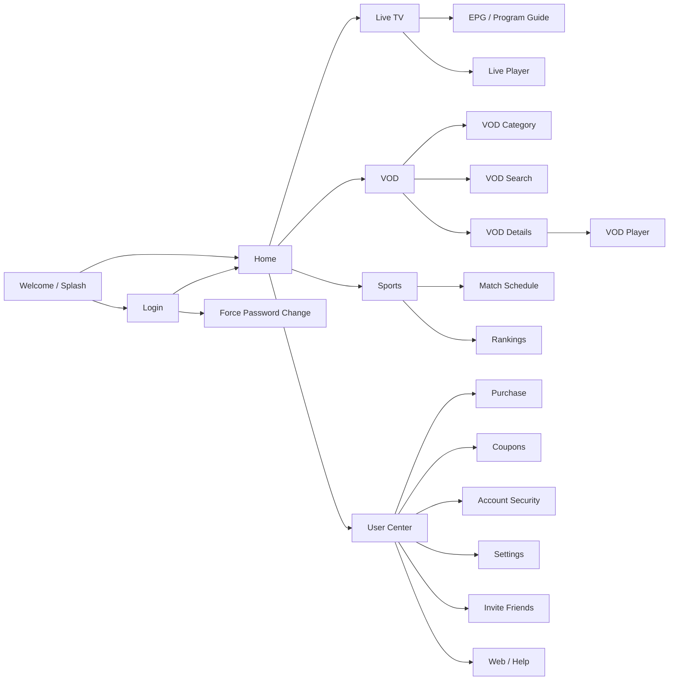

# Mapa de componentes observáveis

## Resumo

A análise convencional recuperou a superfície de produto, mas não o código funcional original. O APK contém **37 entradas de Activity no manifesto**, **481 layouts decodificados**, **1.451 strings** e **quatro classes Smali públicas do carregador**. A lógica de negócio está encapsulada em payloads nativos e carregamento dinâmico.

| Domínio | Entradas observáveis | Evidências de recursos |
|---|---|---|
| Inicialização e autenticação | `WelcomeActivity`, `GuidePageActivity`, `activity_splashmatch.xml`, `activity_login.xml`, diálogos de login e troca de senha | `com.interactive.brasiliptv.ui.activity.WelcomeActivity`, `ForcePasswordChangeActivity` |
| Página inicial | `HomeActivity`, `fragment_home_live.xml`, `activity_home.xml`, itens de canal e busca | Navegação e reprodução inicial em orientação paisagem |
| TV ao vivo | `LiveFreeActivity`, busca por voz, EPG, lista de canais, reserva e menus do player | `activity_live.xml`, `frag_live*.xml`, `layout_live_*.xml`, `layout_epg_*.xml` |
| VOD | categorias, detalhes, busca, tópicos, atores, filtros, conteúdo infantil e Smart TV | `activity_vod*.xml`, `layout_vod_*.xml`, `frag_vod_*.xml`, `item_vod_*.xml` |
| Perfil e conta | centro do usuário, cupons, compras, segurança, registros, QR code, eventos e configurações | `activity_usercenter.xml`, `activity_coupon.xml`, `activity_purchase.xml`, `activity_accountsecurity.xml`, `activity_setting.xml` |
| Esportes | agenda, detalhes, categorias, ranking e estatísticas | `activity_match_*.xml`, `frag_match*.xml`, `layout_match_*.xml`, `item_match_*.xml` |
| Web e suporte | telas Web, feedbacks e diálogos | `CommonWebActivity`, `WebActivity`, `feedback_dialog_*.xml`, `layout_search_feedback.xml` |

## Grafo de navegação inferido

## Contratos locais identificados

O mapa de rotas `assets/therouter/routeMap.json` registra rotas para `VodDetailsActivity`, `VodCategoryActivity`, `TopicActivity`, `SmartvListActivity`, `UserCenterActivity`, `PurchaseActivity`, `InviteFriendsActivity`, `CouponActivity`, `AccountSecurityActivity`, `HomeActivity` e `ForcePasswordChangeActivity`.

As strings indicam contratos de domínio para autenticação, sessão e conta; catálogo VOD, detalhes, temporadas, episódios, atores, diretores, favoritos, histórico e qualidade; live TV, canais, EPG, reserva, áudio, legendas, proporção de tela e troca de player; cupons, planos, compras e convites; restrição de conteúdo adulto e controle parental; jogos, agenda, ranking, estatísticas e replay.

## Integrações observáveis

| Integração | Sinal encontrado | Tratamento na reconstrução |
|---|---|---|
| Player | IJK/FFmpeg e strings de resolução, áudio, legenda, buffer e proporção | Abstração `PlayerGateway`, sem incluir binários do APK |
| Backend | Chaves de domínio para portal, EPG, anúncios, avisos e upgrade | `ApiConfig` com endpoints vazios e injeção de `ContentRepository` |
| Push | Firebase Messaging, Umeng e componentes Alibaba/AGOO | Não ativado por padrão no scaffold |
| Telemetria | Firebase Analytics/Crashlytics, Umeng e serviço de relatório | Interfaces opcionais, sem credenciais copiadas |
| DNS | Qiniu DNS e `NetworkReceiver` | Cliente configurável, sem reutilizar servidores embutidos |
| Armazenamento | Room/SQLite, cache de imagem e histórico nas strings | Repositórios locais mínimos e substituíveis |

## Decisões de implementação

A reconstrução será um projeto Android Kotlin/Jetpack Compose com estado local demonstrável. Ela terá uma navegação em paisagem, telas representativas para Home, Live, VOD, Esportes e Perfil, além de detalhes, busca, login, compra, cupons e configurações. As chamadas de rede serão mockáveis e não apontarão para domínios do APK. A reprodução será modelada por uma interface para permitir integração posterior com um backend e um player devidamente licenciados.

## Evidência técnica

- Manifesto decodificado: `decoded/AndroidManifest.xml`.
- Rotas: `unpacked/assets/therouter/routeMap.json`.
- Domínios: `unpacked/assets/domain_test.json`.
- Recursos: `decoded/res/values/strings.xml`, `decoded/res/layout*`.
- Proteção: `decoded/smali/s/h/e/l/l/S.smali`, `decoded/smali/s/h/e/l/l/N.smali`.
- Payload nativo: `reports/native_metadata.txt`, `reports/protected_payload.txt`.
